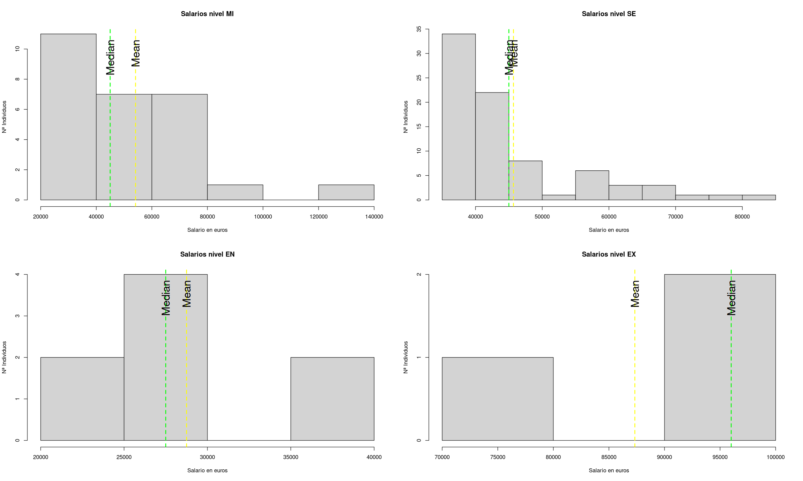
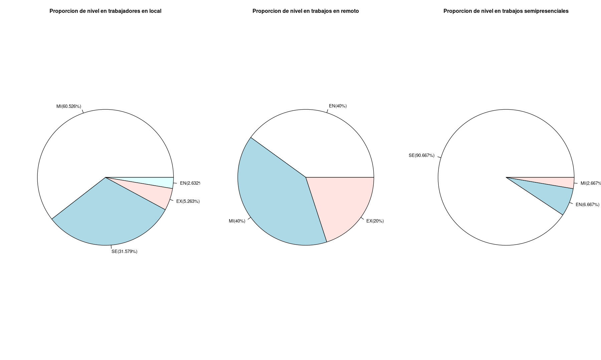

# DataScience salaries
 |  |  |
 |-------------------------------|------------------------------|
## Descripion

Analisis de salarios en el ambito de la ciencia de datos recopilados entre 2020 y 2024.
El objetivo es tener una vision de los salarios en este campo en España.

## Contenido del repositorio

* salarys.ipynb: Notebook que contiene el analisis completo de los datos
* DataScience_salaries_2024.csv: Conjunto de datos
* README.md: Este archivo
* fotos: Carpeta que contiene las fotos del README.md

## Requisitos

Uso de algun visor de **.ipynb**

## Fuente de datos
* Dataset:  ['DataScience_salaries_2024.csv'](https://www.kaggle.com/datasets/saurabhbadole/latest-data-science-job-salaries-2024/data) 
* Autor: [Saurabh Badole](https://www.kaggle.com/saurabhbadole)
* Licencia: CC0 1.0 Universal (CC0 1.0) Public Domain Dedication

> [!NOTE]
Es mi primer analisis de datos 